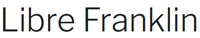
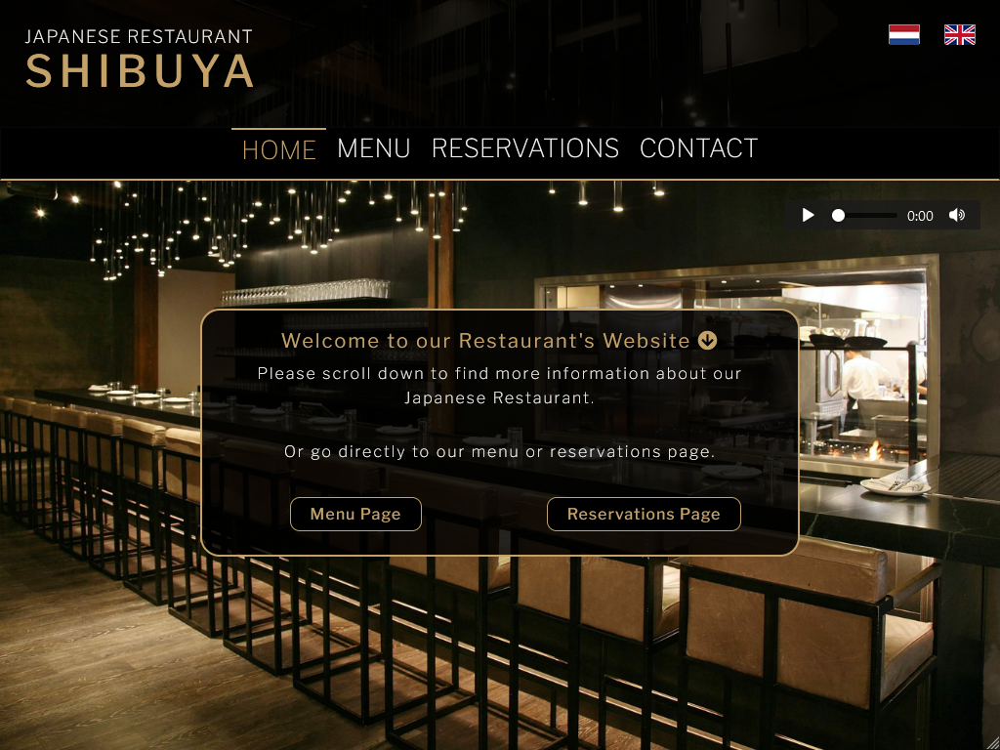
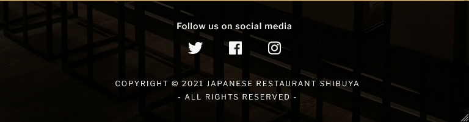
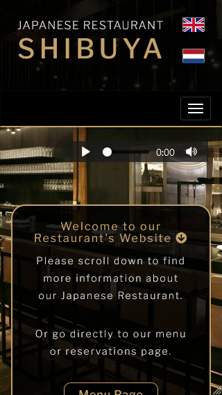
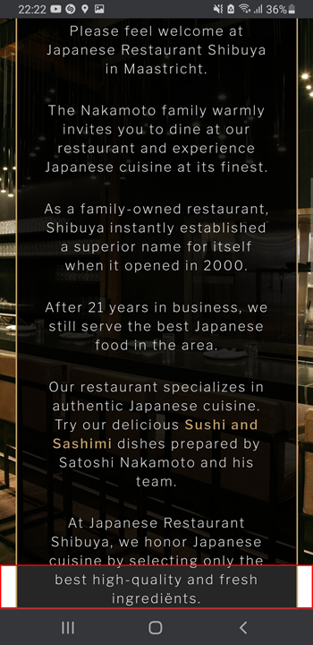
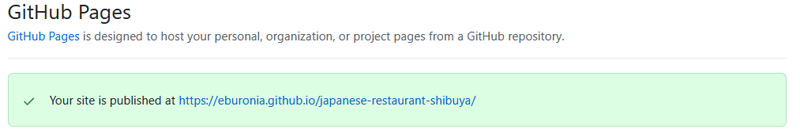
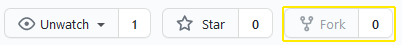
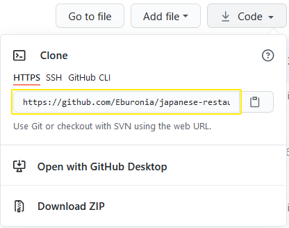
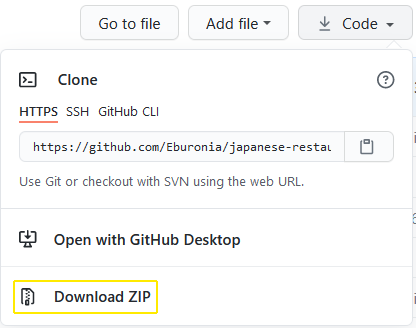

<h1 align="center">Japanese Restaurant Shibuya</h1>

<!-- Responsive Image -->

<!-- Links -->
View the live project [link](https://eburonia.github.io/japanese-restaurant-shibuya/) 
View the GitHub Repository [link](https://github.com/Eburonia/japanese-restaurant-shibuya)

<!-- About -->
## About
These days there are still restaurant owners who are not active on the internet by owning a website or being active on social media.
By creating this example 'Japanese Restaurant Shibuya' website, we will show the importance of being active on the internet to these restaurant owners.
We will give them an idea how a typical restaurant website will look like and we will show them what the added value is.
This website could also be valuable for restaurant owners who already own a personal restaurant website, but are looking for inspiration or new ideas.
  

<!-- Table of Contents -->
## Table of Contents

[User Experience (UX)](#UX)

[Features](#features)

[Technologies Used](#technologies)

[Testing](#testing)

[Known Bugs](#bugs)

[Deployment](#deployment)

[Credits](#credits)

<!-- User Experience (UX) -->

## User Experience (UX)

### User Stories

#### Potential Restaurant Guest - First-time Visitor Goals
1. As a first-time visitor of the website, I want to understand what the website's purpose is, so I can decide to navigate through the website and read all the available information or leave the website in case it does not meet my expectations.
2. As a first-time visitor of the website, I want to know more about the restaurant's atmosphere.
3. As a first-time visitor of the website, I want to know what food the restaurant has to offer and at what price, so that I can decide whether I want to visit the restaurant somewhere in the future in case it meets my needs and expectations.
4. As a first-time visitor of the website, I want to know where the restaurant is located, so that I can decide whether the restaurant is within my desired traveling distance.
5. As a first-time visitor of the website, I want to know what previous guests have to say about the restaurant, so that I have an idea of what to expect when visiting the restaurant.
6. As a first-time visitor of the website, I want to know whether it is possible and needed to make a reservation, so that I can take that into account when I want to visit the restaurant in the future.
7. As a first-time visitor of the website, I want to know on what day and at what time it is possible to visit the restaurant, so that I know when to make a reservation in case I want to visit the restaurant in the future.
8. As a first-time visitor of the website, I want to know what the methods of payment are, so that I know whether to bring cash or a credit card before visiting the restaurant in the future.
9. As a first-time visitor of the website, I want to know how and if I can get additional information about the restaurant in case it's not mentioned on the website.

#### Returning Restaurant Guest - Returning Visitor Goals
1. As a returning visitor of the website, I want to know whether there are new items added to the menu in the recent weeks or months, so that I can decide whether I might order them next time when I visit the restaurant.
2. As a returning visitor of the website, I want to know whether there is any important news or announcement about the restaurant without having to check the website regularly.

### Design

#### Colour Scheme
- To not get distracted too much, and for readability purposes, the used colours on the website meet the colours of the background hero image. Three types are used for styling the html elements:
   * Transparent Black colour: rgba(0, 0, 0, 0.85) - used in headers, footers, and sections background.
   * Cream colour type: rgb(195, 161, 104) - used in the restaurant logo text, h2 and h3 headings, sections, some divisions, image borders, buttons, form text fields, and form drop-down menus.
   * Smokewhite colour: rgb(245, 245, 245) - used in header, footer, navigation bar, paragraphs, menu items, and form labels.
- The sections and some divisions of the website have a black transparent colour. This to keep the hero image in the background a little bit visible, but not too much that you can't read the text anymore.
- For emphasizing purposes a red colour rgb(255, 0, 0) is used for new menu items on the menu page and important messages like required text fields (*) on the reservations and contact form.
- The hover colour of the buttons is a transparent type of Cream colour: rgba(129, 91, 28, 0.5).
- The audio player has not been styled (see also 'Known Bugs' section). 

 
Colour scheme

#### Typography
- [Libre Franklin](https://fonts.google.com/specimen/Libre+Franklin#about) is the only font used throughout the website. Sans Serif is set as a fallback font type. Libre Franklin is a well-readable font. 
This font is based on the 1912 Morris Fuller Benton classic and was designed by Pablo Impallari, an Argentinian type designer based in Rosario.

 
Libre Franklin font

#### Imagery
- A background image (hero) has been added to every page showing the restaurant's interior, giving the visitor an idea about the restaurant's atmosphere.
- Potential customers need to have an idea how some of the menu items might look like in reality. For that reason, every menu category has an example dish image belonging to that category added.
- All images are 'free to use' images, see the credit section for more information about them.

#### Wireframes

Wireframes belonging to the website's project have been made in [Adobe XD](https://www.adobe.com/products/xd.html). PDF files of them can be found here:
- Wireframes of the Index Page - [link](https://github.com/Eburonia/japanese-restaurant-shibuya/blob/2ffdafa655a8ec6e7725af011a44c6b9dacfc1e8/wireframes/wireframes-index.pdf)
- Wireframes of the Menu Page - [link](https://github.com/Eburonia/japanese-restaurant-shibuya/blob/2ffdafa655a8ec6e7725af011a44c6b9dacfc1e8/wireframes/wireframes-menu.pdf)
- Wireframes of the Reservations Page - [link](https://github.com/Eburonia/japanese-restaurant-shibuya/blob/2ffdafa655a8ec6e7725af011a44c6b9dacfc1e8/wireframes/wireframes-reservations.pdf)
- Wireframes of the Contact Us Page - [link](https://github.com/Eburonia/japanese-restaurant-shibuya/blob/2ffdafa655a8ec6e7725af011a44c6b9dacfc1e8/wireframes/wireframes-contact.pdf)

All wireframes were designed for three different devices:
- Desktop - Web: maximum viewport width 1920px
- iPad - Nexus 9: maximum viewport width 768px
- iPhone - 12 Pro Max: maximum viewport width 428px

#### Mockups
The intention was to also create mockups for the website project. Due to the limited available time of the web developer, it has been skipped. Nevertheless, it is important to also invest time in creating mockups for future projects.

<!-- Features -->

## Features

### Header
The header is located at the top of every page and exists out of the restaurant logo, navigation bar, and the preferred website language which are clickable language flags 'English or 'Dutch' and will be automatically loaded on every page.
* <b>Restaurant Logo</b> - The restaurant logo on the upper left side of the screen indicates the website is about a 'Japanese Restaurant' named 'Shibuya' and is a clickable link always redirecting the visitor to the website's index page.
* <b>The Navigation Bar</b> - The navigation bar is part of the header and will be intuitively found by the visitor. A Cream coloured stripe above a navigation item makes it clear to visitors on which active page they are at the moment. The navigation bar will automatically change to a 'Hamburger' type navigation bar at smaller devices (smartphones). Hovering over a navigation bar item will change the colour making it clear to the visitor it's a clickable link.
* <b>Background Colour</b> - A black transparent background colour has been chosen for the header to keep the hero image in the background partly visible.
* <b>Language Flags</b> - Visitors can select the preferred language of the website in the header by clicking on one of the two available language flags 'English' or 'Dutch'. The website will be automatically loaded in the English language when landing on the homepage. By hovering over the flags, a tooltip will show up telling which language the flag represents.
* <b>Background Audio</b> - On the bottom right side of the header, a small audio player has been introduced. A 'Jazzy' audio file has been added to the audio player. To not disturb the visitor when landing on the website, you first need to push the play button to start the audio file. The audio file loops until you press the pause button.

### Footer
The footer has been located at the bottom of every page and exists out of social media links, and a copyright notice.
* <b>Background Colour</b> - A black transparent background colour has been chosen for the footer to keep the hero image in the background partly visible.
* <b>Social Media Links</b> - Icons representing social media platforms from the [fontawesome.com](https://www.fontawesome.com/) website are introduced as anchor links to redirect the visitor to the restaurant's external social media pages (blank page). By hovering over the links, the colour changes from Whitesmoke to Cream colour indicating these are clickable links.
* <b>Copyright Notice</b> - A clear copyright notice is visible at the bottom of the footer.

### Hero Background Image
A fixed background (hero) image of the Restaurant interior has been added to every page.

### Sections/Divisions
Depending on which page you are, the website has one or multiple sections/divisions containing content. You can recognize these sections/divisions by a black transparent container surrounded by a Cream coloured border including a border-radius. All sections/divisions start with a Cream coloured h2 heading including a [fontawesome.com](https://www.fontawesome.com/) icon at the end.

### Menu Page
The 'Menu' page exists out of a combination of sections (menu items) and divisions (images). These are inline next to each other for bigger screen sizes. When the device width becomes smaller, the sections and divisions will be on top of each other (block type) to keep it readable.

### Forms
The forms on the 'Reservations' and 'Contact' pages both have the same styling. The labels, text fields, drop-down menus, and h2 heading will be smaller in size on smaller devices (smartphones) for readability purposes.

### Paragraphs
For consistency, all paragraphs have the same styling.

### Links
Only the index page has clickable links outside the header and footer of every page.
Links on the index page you can find in the 'Welcome' and 'About' sections of the page. The anchor links in the 'Welcome' section are styled in such a way they look like buttons and are also styled the same way as the buttons used on the website. A button could no be used because JaveScript was needed to redirect them to the other pages, for that reason the anchor links were styled to look like a button.
The anchor links in the 'About' section are styled into a Cream coloured bold text to distinguish themselves from the remaining text. By hovering over the links, an underline will appear making it clear to the visitor these are clickable links. 

### Buttons
Buttons can be found in the form sections of the Index page (Mailing List), Reservations page, and Contact page and are all styled in the same way: Cream colour border and text and a black background. When hovering over the buttons, also the background colour will change into a Cream type of colour, making it clear to the visitor it's a clickable button.  
  
Typical form button

### Responsiveness
All pages are responsive on all devices. Minimum viewport width: 320px.

### Accessibility
* All images have been foreseen with an alternative (alt) text in case the image cannot be loaded. This also helps the screen readers.
* Aria-labels have been introduced where needed to give important information to the screen readers.

### Future Features
* Feedback from previous visitors can be found on the social media pages of the restaurant. To directly implement feedback on the website, a guestbook might be a good idea to incorporate on the website in the future.
* An older version of bootstrap has been implemented for the navigation bar only. To be updated to the latest version in the future.

<!-- Technologies Used -->

## Technologies Used

### Languages Used
- [HTML5](https://en.wikipedia.org/wiki/HTML5)
- [CSS3](https://en.wikipedia.org/wiki/CSS)

### Frameworks, Libraries and Programs Used
- [Bootstrap v3.4.1](https://getbootstrap.com/docs/3.4/) - Only used for the responsive navigation bar, especially needed for creating the hamburger-styled menu on smaller devices like smartphones.
- [jquery v3.5.1](https://jquery.com/download/) - Used for the hamburger-styled menu for the navigation bar, part of the bootstrap framework.
- [Google Fonts:](https://fonts.google.com/specimen/Libre+Franklin) - The 'Libre Franklin' font is imported from the Google Fonts Website into the header.css file. This font is the only used font on all pages of the website.
- [Font Awesome](https://www.fontawesome.com/) - Font Awesome icons are used on the website for linking to the social media pages of the restaurant, payment methods, and in the h2 heading of the website sections/divisions.
- [Git](https://git-scm.com/) - Git was used for version control and code change tracking of the website project. The terminal in Gitpod was used to commit and to push the project to the Github repository.
- [Github](https://github.com/) - The project code has been stored on the Github website.
- [GitPod](https://www.gitpod.io/) - GitPod was used for creating the code, testing of the website, commiting, and pushing the code to the github repository. 
- [Photoshop v8.0](https://www.photoshop.com/en) - An older version of Photoshop (Photoshop CS version 8.0) was used to resize images and to create the Dutch and United Kingdom language flags which you can find in the header.
- [Adobe XD](https://www.adobe.com/products/xd.html) - Adobe XD was used to create the website's Wireframes. To see the Wireframes, go to the Design section above to see the results.
- [JPEG Optimizer](http://jpeg-optimizer.com/) - JPEG Optimizer website was used to compress the sizing of the images to speed up loading time when loading the website/webpage.

<!-- Testing -->

## Testing

### Functionality Checklist

#### Common
- Check aria labels. **(checked)**
- Check alternative 'alt' text. **(checked)**
- Check transparency of header, footer, and sections/divisions. **(checked)**
- Check the spelling of the page content (English and Dutch). **(checked)**
- Check loading speed of images on all pages. **(checked)**

#### Hero Image
- Check whether there is any strange behavior of the hero image on different devices. **(checked / see known bugs section)**

 
iPad mini screenshot

#### Header/Navigation Bar
- Check whether the header is always on top of the page. **(checked)**
- Check whether the restaurant logo links back to the index page. **(checked)**
- Check the 'Active' page in the navigation bar and the remaining links change colour while hovering. **(checked)**
- Check for dead links. **(checked)**
- Check whether website language links are working properly. **(checked)**
- Check the responsiveness of the navigation bar (change to hamburger-style navigation). **(checked)**
- Check whether there is no overflow while reducing the screen size. **(checked)**
- Check whether audio player is working properly. **(checked)**

#### Footer
- Check whether the footer is always at the bottom of the page. **(checked)**
- Check whether all social media links are working properly and are opening a new blank page. **(checked)**
- Check whether the social media links change colour while being hovered. **(checked)**
- Check for dead links. **(checked)**
- Check the responsiveness of the footer when changing the size of the viewport. **(checked)**

 
Footer screenshot

#### Index Page
- Check for dead links. **(checked)**
- Check whether the required e-mail field in the mailing list section is functioning. **(checked)**
- Check the responsiveness of the sections when changing the size of the viewport. **(checked)**
- Check transparency of the background in the sections. **(checked)**
- Check Functionality of restaurant location section / image. **(checked)**
- Check Payment section links. **(checked)**

#### Menu Page
- Check the responsiveness of the menu sections when changing the size of the viewport. **(checked)**
- Check correct order of menu categories and images at smaller viewport width. **(checked)**
- Check correct styling for every menu category. **(checked)**

#### Reservations Page
- Check the responsiveness of the reservations form when changing the width of the viewport. **(checked)**
- Check functionality of required fields. **(checked)**
- Check the result of Code Institute's 'action' page after submitting the form. **(checked)**

#### Contact Page
- Check the responsiveness of the contact form when changing the width of the viewport. **(checked)**
- Check functionality of required fields. **(checked)**
- Check the result of Code Institute's 'action' page after submitting the form. **(checked)**

#### 404 Page
- Check whether 404 page loads when entering a wrong link address. **(checked)**
- Check the 'back to homepage' anchor links 'going to English index page' and 'going to Dutch index page'. **(checked)**

### Usability Testing
- Family and friends were asked to test the website and to navigate through all four website pages. Buttons, links, and forms were tested by them.

 
iPhone 5 screenshot

### Compatibility Testing
The following browsers were used for compatibility testing:
- Firefox
- Google Chrome
- Microsoft Edge  
See 'Known Bugs' 
section for more information about the outcome.

### Further Testing
The following devices were used for testing the website:
- Desktop: Asus ZenBook (viewport: 1920px * 1080px) 
- Smartphone: Samsung S9+ (viewport: 360px * 740px)
- Smartphone: iPhone 11 (viewport: 414px * 896px)

During the building of the website, [Google Chrome DevTools](https://developer.chrome.com/) was used to simulate different viewport sizes.
The website is designed for a minimum viewport width of 320px (iPhone 5 size).

### Testing Code
The following online validators were used to check whether the website generated any html and CSS syntax errors:

#### W3C Markup Validator

W3C Markup Validator, results of English language pages:
* [index.html](https://validator.w3.org/nu/?doc=https%3A%2F%2Feburonia.github.io%2Fjapanese-restaurant-shibuya%2Findex.html)
* [menu.html](https://validator.w3.org/nu/?doc=https%3A%2F%2Feburonia.github.io%2Fjapanese-restaurant-shibuya%2Fmenu.html)
* [reservations.html](https://validator.w3.org/nu/?doc=https%3A%2F%2Feburonia.github.io%2Fjapanese-restaurant-shibuya%2Freservations.html)
* [contact.html](https://validator.w3.org/nu/?doc=https%3A%2F%2Feburonia.github.io%2Fjapanese-restaurant-shibuya%2Fcontact.html)

No errors found.

W3C Markup Validator, results of Dutch language pages:
* [index-nl.html](https://validator.w3.org/nu/?doc=https%3A%2F%2Feburonia.github.io%2Fjapanese-restaurant-shibuya%2Fnl%2Findex-nl.html)
* [menu-nl.html](https://validator.w3.org/nu/?doc=https%3A%2F%2Feburonia.github.io%2Fjapanese-restaurant-shibuya%2Fnl%2Fmenu-nl.html)
* [reservations-nl.html](https://validator.w3.org/nu/?doc=https%3A%2F%2Feburonia.github.io%2Fjapanese-restaurant-shibuya%2Fnl%2Freservations-nl.html)
* [contact-nl.html](https://validator.w3.org/nu/?doc=https%3A%2F%2Feburonia.github.io%2Fjapanese-restaurant-shibuya%2Fnl%2Fcontact-nl.html)

W3C Markup Validator results of 404 page:
* [404.html](https://validator.w3.org/nu/?doc=https%3A%2F%2Feburonia.github.io%2Fjapanese-restaurant-shibuya%2F404.html)

No errors found.
Remark: Mixing up section and article elements gives problems to pass the W3C Markup Validator. Article elements were deleted.

#### W3C CSS Validator

W3C CSS Validator, results of the style sheets:
* [contact.css](https://jigsaw.w3.org/css-validator/validator?uri=https%3A%2F%2Feburonia.github.io%2Fjapanese-restaurant-shibuya%2Fassets%2Fcss%2Fcontact.css&profile=css3svg&usermedium=all&warning=1&vextwarning=&lang=en)
* [footer.css](https://jigsaw.w3.org/css-validator/validator?uri=https%3A%2F%2Feburonia.github.io%2Fjapanese-restaurant-shibuya%2Fassets%2Fcss%2Ffooter.css&profile=css3svg&usermedium=all&warning=1&vextwarning=&lang=en)
* [header.css](https://jigsaw.w3.org/css-validator/validator?uri=https%3A%2F%2Feburonia.github.io%2Fjapanese-restaurant-shibuya%2Fassets%2Fcss%2Fheader.css&profile=css3svg&usermedium=all&warning=1&vextwarning=&lang=en)
* [index.css](https://jigsaw.w3.org/css-validator/validator?uri=https%3A%2F%2Feburonia.github.io%2Fjapanese-restaurant-shibuya%2Fassets%2Fcss%2Findex.css&profile=css3svg&usermedium=all&warning=1&vextwarning=&lang=en)
* [menu.css](https://jigsaw.w3.org/css-validator/validator?uri=https%3A%2F%2Feburonia.github.io%2Fjapanese-restaurant-shibuya%2Fassets%2Fcss%2Fmenu.css&profile=css3svg&usermedium=all&warning=1&vextwarning=&lang=en)
* [reservations.css](https://jigsaw.w3.org/css-validator/validator?uri=https%3A%2F%2Feburonia.github.io%2Fjapanese-restaurant-shibuya%2Fassets%2Fcss%2Freservations.css&profile=css3svg&usermedium=all&warning=1&vextwarning=&lang=en)
* [style.css](https://jigsaw.w3.org/css-validator/validator?uri=https%3A%2F%2Feburonia.github.io%2Fjapanese-restaurant-shibuya%2Fassets%2Fcss%2Fstyle.css&profile=css3svg&usermedium=all&warning=1&vextwarning=&lang=en)

No errors found.

### Testing Grammar and Spelling 
- [Grammarly.com](https://www.grammarly.com/) was used to check grammar and spelling.

### Testing User Stories from User Experience (UX) Section

#### Potential Restaurant Guest - First-time Visitor Goals
1. As a first-time visitor of the website, I want to understand what the website's purpose is, so I can decide to navigate through the website and read all the available information or leave the website in case it does not meet my expectations.
   * At the upper left corner in the website's header, the website's company logo 'Japanese Restaurant Shibuya' immediately tells new visitors that they have ended up on a Japanese Restaurant website.
   * To make it even more clear, a background (hero) image of the restaurant has been added to every page, telling the first time visitors they probably have ended up on a restaurant website.
   * A navigation bar in the header at the top of every page has links included to a 'Menu' and 'Reservations' page which also suggests the website is probably about a restaurant.
   * To make the purpose of the website totally clear, a 'Welcome' section on the index page has been added, stating that visitors have ended up on a Japanese Restaurant website. Also, the 'About' section below the 'Welcome' section gives more background information about the website and its purpose, which of course is an introduction to the restaurant.

2. As a first-time visitor of the website, I want to know more about the restaurant's atmosphere.
   * A clear background (hero) image of the restaurant has been added to every page, so that visitors of the website immediately know how the interior of the restaurant looks like. 

3. As a first-time visitor of the website, I want to know what food the restaurant has to offer and at what price, so that I can decide whether I want to visit the restaurant somewhere in the future in case it meets my needs and expectations.
   * In the navigation bar, a link to the 'Menu' page has been added. Also in the 'Welcome' section on the index page, a styled anchor link (looks like a button) has been added to directly send potential guests to the 'Menu' page.
   * On the 'Menu' page, the menu has been subdivided into different categories (listing category items including pricing). To make it clear to guests what they can expect when they make an order, one menu item image per category has been added to the menu.

4. As a first-time visitor of the website, I want to know where the restaurant is located, so that I can decide whether the restaurant is within my desired traveling distance.
   * On the index page in the 'About' section, it is indicated that the restaurant is located in the city of Maastricht. The 'Find Us' section on the index page, clearly states the restaurant's address. Also, a 'Google Maps' image of the location of the restaurant has been added to the index page.

5. As a first-time visitor of the website, I want to know what previous guests have to say about the restaurant, so that I have an idea of what to expect when visiting the restaurant.
   * In the website's footer, external links to the restaurant's social media channels have been added. Here previous and returning guests of the restaurant make comments and discuss with other people how they have experienced their visit to the restaurant.
   * Not implemented on the website for now, but an online guestbook on the website would also be a good idea to get feedback from previous guests.

6. As a first-time visitor of the website, I want to know whether it is possible and needed to make a reservation, so that I can take that into account when I want to visit the restaurant in the future.
   * In the navigation bar, a link to the 'Reservations' page has been added.
   * In the 'About' section of the index page, a styled anchor link (looks like a button) has been added to directly send potential guests to the 'Reservations' page.
   * On the 'Reservations' page a clear form has been added with all the needed information to make a reservation at the restaurant.
   * The 'About' section on the index page states to make a reservation with a link to the reservations page.

7. As a first-time visitor of the website, I want to know on what day and at what time it is possible to visit the restaurant, so that I know when to make a reservation in case I want to visit the restaurant in the future.
   * On the index page of the restaurant, an 'Opening Hours' section has been added which indicates on what day and between what hours the restaurant is opened.
   * On the reservation form on the 'Reservations' page, a drop-down menu where you can select your desired date and a drop-down menu where you can select your desired time when you can make a reservation have been added.

8. As a first-time visitor of the website, I want to know what the methods of payment are, so that I know whether to bring cash or a credit card before visiting the restaurant in the future.
   * On the index page of the website, a 'Payment Methods' section has been added. It clearly states cash is accepted (Euro only). It also indicates icons of accepted credit cards and even bitcoin cash is accepted (the green colour for the bitcoin icon is on purpose to make a distinction between credit cards and crypto).

9. As a first-time visitor of the website, I want to know how and if I can get additional information about the restaurant in case it's not mentioned on the website.
   * In the navigation bar, a link to the 'Contact' page has been added. On this page, a form has been added where you can send a message in case you want to ask a question or you want additional information about the restaurant.
   * The 'Find us' section on the index page, also states the website's e-mail address and a phone number.

#### Returning Restaurant Guest - Returning Visitor Goals
1. As a returning visitor of the website, I want to know whether there are new items added to the menu in the recent weeks or months, so that I can decide whether I might order them next time when I visit the restaurant.
   * On the 'Menu' page, it's indicated which new menu items are added by adding next to the description of these menu items 'new' with a red colour.
   * At the bottom of the menu, it's clearly stated when the menu was updated for the last time.

2. As a returning visitor of the website, I want to know whether there is any important news or announcement about the restaurant without having to check the website regularly.
   * On the index page, a 'Mailing List' section has been added. Here visitors who are interested can add their e-mail address, so they will receive the latest news and announcements about the restaurant in their e-mail box.

<!-- Known Bugs -->

## Known Bugs
- Slow loading time of the hero image and menu images when loading the website for the first time. The problem can probably be solved by reducing the file size. **This has been fixed but still can be optimized if needed.**
- The bootstrap navigation bar shows a small black border (1px?) around the navigation bar. 
- Styling of audio player gives bad styling quality in Microsoft Edge and Google Chrome. The styling of the audio player has been removed for now. I am also not satisfied how the audio player looks in these browsers.
- The date field on the reservations page works differently using Google Chrome, Microsoft Edge, and Firefox browsers. The styling of the date input field had to be adjusted for the Google Chrome and Microsoft Edge browsers (see also Credits section).
- The hero background image sometimes won't stay fixed when scrolling on smaller devices (smartphone), it moves up a little bit showing a white background on the bottom of the hero image. When releasing your finger from the screen (stop scrolling) the hero image will reposition itself and will automatically cover the whole viewport, see also image below. Maybe this has something to do with loading the hero image in the body element instead of the division element?

<!-- Deployment -->

## Deployment

### Publishing
'GitHub Pages' was used for publishing the website. The procedure was as follows:
1. Login to the [GitHub](https://www.github.com/) website.
2. On the left side of your screen, you can find a summary of all your repositories. Select [Eburonia/japanese-restaurant-shibuya](https://github.com/Eburonia/japanese-restaurant-shibuya)
3. You can find a ribbon on the top of your screen. In the ribbon, click on 'Settings'.
4. In the selection menu on the left side of your screen, click on 'Pages'.
5. Beneath 'Source' you will find a small pull-down menu. Click on it and select 'main', then press the 'Save' button.
6. You will get automatically redirected to the 'GitHub Pages' page. There you will see a blue text box telling the site will be published.
7. Refresh the page after a minute and when this text box turns green, the website has been published.
8. Click the link in the green text box to go to your published website.

### Forking
If you want to make a copy of the repository you can Fork it without changing the original repository by following the next procedure:
1. Login to the [GitHub](https://www.github.com/) website.
2. On the left side of your screen, you can find a summary of all your repositories. Select [Eburonia/japanese-restaurant-shibuya](https://github.com/Eburonia/japanese-restaurant-shibuya)
3. On the right side of your screen, next to 'Unwatch' pull-down menu, and the 'Star' button, you can find the 'Fork' button.
4. By clicking this button, it will create a copy of the website in your repository.

### Cloning
You can clone the repository by following the next procedure:
1. Login to the [GitHub](https://www.github.com/) website.
2. On the left side of your screen, you can find a summary of all your repositories. Select [Eburonia/japanese-restaurant-shibuya](https://github.com/Eburonia/japanese-restaurant-shibuya)
3. Click on the 'Code' button next to the Green 'GitPod' button.
4. Click on 'HTTPS' and copy the hyperlink below it.
5. Go to the repository where you want to make a clone of the website. Or create a new repository.
6. When in this repository, select the folder or create a folder where you want to clone the directory.
7. Go to the terminal and type: 'Git Clone (copied link)' and press enter. The directory has been cloned now.

### Downloading
You can download the repository by following the next procedure:
1. Login to the [GitHub](https://www.github.com/) website.
2. On the left side of your screen, you can find a summary of all your repositories. Select [Eburonia/japanese-restaurant-shibuya](https://github.com/Eburonia/japanese-restaurant-shibuya)
3. Click on the 'Code' button next to the Green 'GitPod' button and then click on 'Download ZIP'.
4. A .zip file of the repository content will be downloaded. 

<!-- Credits -->

## Credits

### Code
- All html and CSS code was written by the website creator: Maurice Vossen
- Colours were selected by using Photoshop v8.0
- Understanding 'float' and 'clear' CSS code [link](https://www.youtube.com/watch?v=xara4Z1b18I)
- Understanding 'display: flex' CSS code [link](https://css-tricks.com/snippets/css/a-guide-to-flexbox/)
- W3Schools example code for creating a Bootstrap navigation bar in the header [link](https://www.w3schools.com/bootstrap/bootstrap_navbar.asp)
- Changing the outline colour of a textarea [link](https://stackoverflow.com/questions/9345656/changing-the-outline-color-of-a-textarea)
- Transition on Hover [link](https://www.w3schools.com/howto/howto_css_transition_hover.asp)
- Change text colour in nav bar “Bootstrap” [link](https://stackoverflow.com/questions/30842694/change-text-color-in-nav-bar-bootstrap/30842777)
- Selecting first child CSS code [link](https://www.w3schools.com/cssref/tryit.asp?filename=trycss_sel_firstchild)
- Selecting second child CSS code [link](https://www.w3schools.com/cssref/sel_nth-child.asp)
- CSS Flex Responsive [link](https://www.w3schools.com/css/css3_flexbox_responsive.asp)
- Change the background colour of the select list [link](https://crosstec.org/en/forums/15-usage/125393-change-the-background-color-of-the-select-list.html)
- Change colour of Chrome's calendar icon in HTML date input (see also 'Known Bugs' section)[link](https://stackoverflow.com/questions/62162645/change-color-of-chromes-calendar-icon-in-html-date-input)

### Content

#### README file
- The following README files were used as inspiration for creating the README file of the project:
   * Boredom Guide [link](https://github.com/LigaMoon/Boredom-guide/blob/master/README.md)
   * Code Institute Website [link](https://github.com/Code-Institute-Solutions/SampleREADME)
   * Code Institute Love Running [link](https://github.com/Code-Institute-Solutions/readme-template)

#### About Section
- Inspiration for Restaurant's 'About' section:
   * Partly copied and adjusted from: [Japanese Restaurant Kobe Maastricht](https://www.restaurantkobe.com/)
   * Partly copied and adjusted from a New York based Japanese restaurant. The source couldn't be found anymore.

#### Menu Page
- Inspiration for the menu page:
   * Example Japanese menu [link](https://i.pinimg.com/originals/d3/2e/f4/d32ef41a9a546250ab54f856e1f71b6f.jpg)
   * The 8 Most Popular Types of Fish Served as Sashimi [link](https://rbsushi.com/blog/8-most-popular-types-of-fish-served-as-sashimi/)
   * Types of Sashimi in Japan: The Essential Guide [link](https://gurunavi.com/en/japanfoodie/2016/10/sashimi-in-japan.html?__ngt__=TT11bfdb473003ac1e4ae61dJHkbBnFG9SLeZoHOmkr4Ow)
   * Wikipedia: List of Japanese soups and stews [link](https://en.wikipedia.org/wiki/List_of_Japanese_soups_and_stews)
   * 10 Must Drink Types of Popular Japanese Alcohol [link]( https://gurunavi.com/en/japanfoodie/2017/07/10-must-drink-japanese-alcohol.html)
   * How Many of These 10 Popular and Tasty Japanese “Yaki” Dishes Have You Tried? [link](https://jpninfo.com/105574)

### Media

#### Images
- All pictures shown are for illustration purposes only and are not owned by the web developer, all copyrights and credit go to the respective owner.
- The free to use background (hero) image is coming from [Unsplash.com](https://unsplash.com/@dineshramaswamy)
- For the menu page, the following images were taken from the [pixabay](https://www.pixabay.com/) website:
   * Sushi image [link](https://pixabay.com/photos/sushi-food-japan-2363418/)
   * Sashimi image [link](https://pixabay.com/photos/sashimi-food-seafood-tuna-cuisine-2563650/)
   * Okinawa Soba [link](https://pixabay.com/photos/okinawa-soba-okinawa-1697765/)
   * Takoyaki [link](https://pixabay.com/photos/food-takoyaki-ball-1614130/)
   * Highball Whiskey [link](https://pixabay.com/photos/whiskey-highball-nanning-654449/)   
- The Dutch and United Kingdom flags used for selecting the website language were created by the website developer himself.  

 
Dutch/United Kingdom flags

#### Audio
- The audio player's Jazzy mp3 file is a copyright free audio file coming from Youtube/Soundclound: Ryan - Milk Coffee [No Copyright Music]
   * Youtube [link](https://www.youtube.com/watch?v=eSOV2Zo_J1A)
   * Soundcloud [link](https://soundcloud.com/user-909504386/milk-coffee-jazz)

### Acknowledgements
- Thanks to my personal mentor Maranatha Ilesanmi for answering my questions and giving feedback to this project.
- The many free coding forums on the internet, especially [Stackoverflow.com](https://www.stackoverflow.com/) for providing answers to my coding questions. Most of my questions were already asked by other users of the stackoverflow website, making it easy to find quick answers.